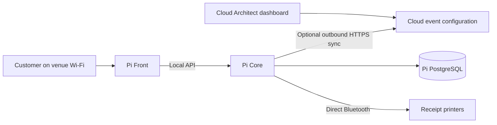

# Cloud Architect and local event QR codes

The cloud Architect can prepare event names, local QR destinations, table
assignments, labels and enabled states. The Pi stores an independent copy and
serves customers entirely on its LAN, including while internet is unavailable.
QR Studio remains a development tool and is not installed on the Pi.

These controls manage QR configuration. They do not change Pi network settings,
Docker ports, local DNS, menus, staff accounts or order history. The cloud never
opens a connection to the Pi's private address.



## Prepare an event in the cloud

1. Log in to the cloud Architect dashboard and open the event QR section for
   the venue. Create an event and give it a recognizable name.
2. Set **App URL** to the origin customers will open, for example
   `http://noor-node.local:8080`.
3. Set **API URL** to that Pi's public QR resolver, normally
   `http://noor-node.local:8080/api`.
4. Add the desired `GT-XXXX-XXXX` codes, assign venue tables, edit labels and
   choose which codes are enabled. Save the event.
5. Apply the saved event to the Pi using an export/import or the optional
   pairing below. Verify it from a phone on the venue Wi-Fi before printing.
6. Use **Print enabled QR codes**. The printed destination includes the event
   ID: `http://noor-node.local:8080/api/q/GT-ABCD-2345?event=<event-id>`.

The Pi must already contain the matching venue and table IDs. The prepared
Noor data has those IDs. If a cloud event uses a newly created table that is
absent locally, import is rejected; create/synchronize the venue data through
a separately reviewed operation before using that table. QR sync never adds
or replaces venue data.

The customer's app always calls its own origin's `/api` proxy. An event's API
URL determines where a QR scan is resolved; it does not override browser API
configuration or pass another API host through a query string. Use the Pi's
public Front address with `/api`, keeping Core's raw port on loopback.

## Apply an export without an ongoing cloud connection

Download the saved event's JSON export from the cloud Architect dashboard.
Transfer that file to a trusted device on the Pi LAN. Log in to the **local**
Architect account, open event QR management and import the file.

The imported configuration is read-only locally. Make edits in the cloud and
import a newer export. Re-importing the identical revision is harmless; older
revisions and changed content with the same revision are rejected. Exports
contain only QR event configuration and do not include account passwords,
staff records or orders. A local architect can import them; a cloud login
session is never sent to the Pi.

## Optional automatic updates from the cloud

This requires outbound HTTPS only while updates are being applied. No MQTT,
inbound Pi port, tunnel or cloud architect login token is needed. Each pairing
token is restricted to reading one event and acknowledging its applied
revision. Keep the file private; do not commit it or put it under web uploads.

In the cloud event, choose **Create pairing token**, then **Download pairing
file**. The token is shown once. The download has this structure:

```json
{
  "eventId": "the-event-uuid",
  "cloudApiUrl": "https://your-cloud-core.example.com",
  "token": "the-issued-event-specific-token"
}
```

Use the actual downloaded values; the example placeholders are not valid
credentials. The cloud URL must be HTTPS and may include the API prefix used
by that deployment. Put the downloaded object in `data/qr-sync.json` beside
this runbook. For several events, use a JSON array of these objects, one per
distinct event ID, with a maximum of 32. Every event must belong to the Pi's
configured `STORE_SLUG`.

Run the normal Pi stack first, with QR sync still disabled. Find the numeric
group of its actual Core container, then restrict the new pairing file so
Core can read it:

```bash
cd Garsone-Core/deploy/pi/full-stack
core_gid="$(docker compose --env-file .env -f compose.yml exec -T core id -g)"
[[ "$core_gid" =~ ^[0-9]+$ ]] || exit 1
sudo chown "root:$core_gid" data/qr-sync.json
sudo chmod 640 data/qr-sync.json
```

The previously tested Core image reports UID/GID `999:999`; derive the value
from the deployed container as above because image users can change. Mode
`0600` owned by your SSH user prevents the non-root Core process from reading
the file. On installations using Docker user namespace remapping, use the
corresponding mapped host group instead. Keep other users out of the release
directory, and leave the original private Noor snapshot unchanged.

Set the following in the Pi's `.env`, then restart through the release helper:

```dotenv
QR_SYNC_ENABLED=true
```

```bash
bash pi.sh start
docker compose --env-file .env -f compose.yml -f compose.qr-sync.yml exec -T core \
  node -e "require('fs').accessSync('/run/garsone/qr-sync.json', require('fs').constants.R_OK)"
```

The final command checks readability without displaying the token. The helper
mounts the file read-only only when sync is enabled. Core attempts updates on
startup and approximately once per minute. Failed requests or rejected imports
leave the previously applied event usable. Data is saved before the cloud is
acknowledged; if only the acknowledgement fails, the newer local data remains.

The cloud dashboard shows the last acknowledged revision/time. That is an
acknowledgement of an applied configuration, not a guarantee that the Pi is
currently online. Confirm the event on the local Pi before admitting guests.

To stop future automatic updates, set `QR_SYNC_ENABLED=false` and run
`bash pi.sh start` again. The Pi keeps its last imported event for offline use.
**Revoke pairing** or **Replace pairing token** in the cloud invalidates the
previous token for future cloud requests. Revocation does not erase or disable
copies already stored on a disconnected Pi. To disable a local event, apply
its disabled revision while connected or import that revision locally.

## Reusing printed cards and changing addresses

Changing table assignments, labels or enabled states within the **same event**
keeps its existing printed URLs. Save and apply the new revision before using
the cards. Another event may reuse the same `GT-...` code independently, but
its URL contains a different event ID and therefore needs its own printed QR.

Changing the printed API host, port or path requires reprinting. Changing the
app hostname also requires a coordinated Pi address change; plan to reprint
and retest the event's local QR destinations. Existing paper cannot learn an
unreachable new address. Reserve the Pi's LAN IP or use stable local DNS to
avoid address changes between events.

When changing an address, arrange local DNS/DHCP and any proxy/port changes on
the Pi first. Update `.env` `PUBLIC_HOST`, `PUBLIC_ORIGIN` and, if applicable,
`FRONT_PORT`, run `bash pi.sh start`, then set the event's App/API URLs to those
matching addresses and apply the revision. The dashboard does not perform
these network changes automatically. `PUBLIC_ORIGIN` controls the accepted
browser origin; simply editing an event cannot add a new trusted login origin.

Phones must resolve that hostname and reach the Pi on venue Wi-Fi. Test a QR
scan, menu load and order locally with internet disconnected before printing
the whole batch or relying on it at an event.
